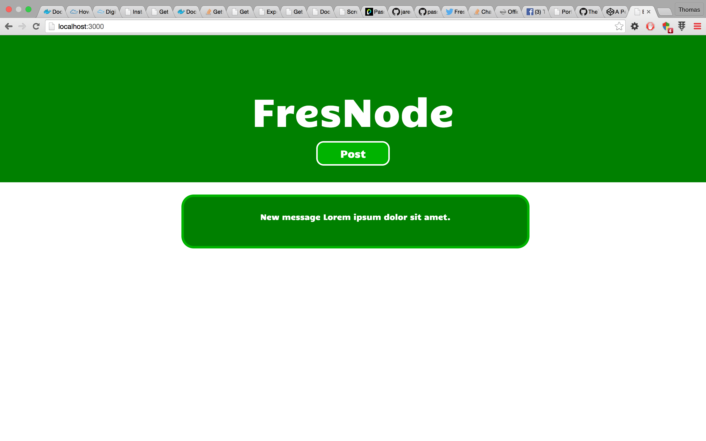
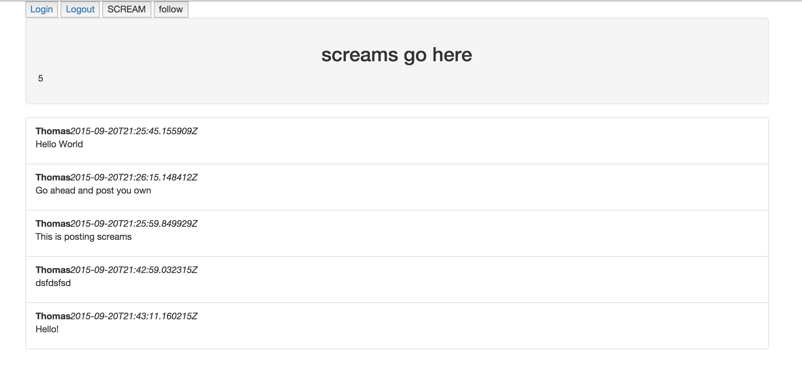
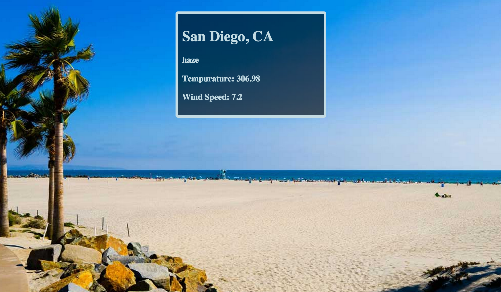

## FresNode
FresNode is a project I'm working on for the Fresno Node.js meetup group. The users will be able to log in with an oAuth of their choosing, and post a message! The backend is built on node.js, with handlebars as the templating engine. Information is stored using MongoDB.

For further details on FresNode, please visit the [repository on Github](https://github.com/TheTommyTwitch/fresnode).

## Twitter Clone aka "Screamer"
This was a project I did for the web development bootcamp at Fresno City College. It is meant to be a very simplistic clone of twitter. Users log in with their google account, and then they can post "screams". The backend is written in Golang, and powered by [Google App Engine](https://cloud.google.com/). Everything is stored in the app-engine datastore.

For further details on Screamer, please visit the [repository on Github](https://github.com/TheTommyTwitch/twitter-project).

## Get the weather!
This is a fun little page I made to display the current weather in San Diego, California. It uses an API from [Open Weather Map](http://openweathermap.org), and even changes the background picture based on weather conditions!  

Check it out! [Code on Codepen](http://codepen.io/TheTommyTwitch/pen/EVVaGV).

